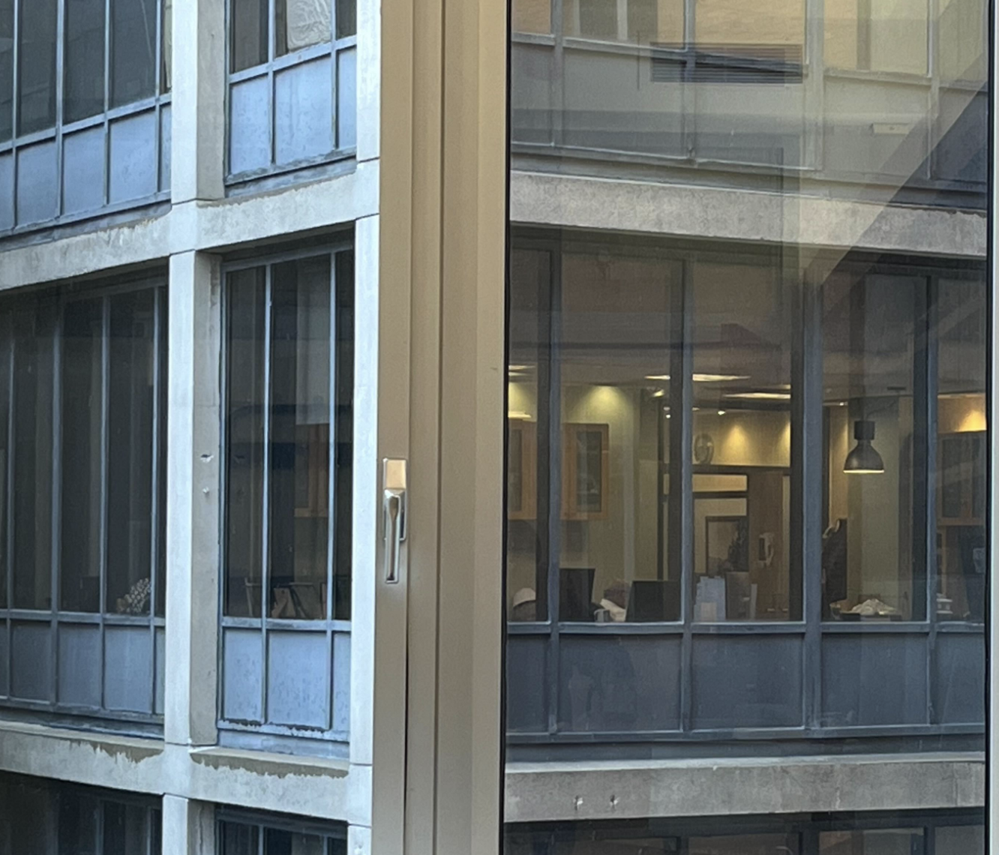

I work in a dense urban campus, and the view from my building looks into the windows of the next building over.

Sometimes, when I meet with my advisor, I sit at a table facing that window. On these days, a strange thing happens. When I look up at my advisor, I get the eerie sensation in the corner of my eye that there is a face in that window watching me. Of course, when I look at the window, the face vanishes—there is no one there.

I have been chalking this up to the paranoid hallucinations of a tired brain. But a chance email from a professor this week made me realize what is actually going on here.

When I look up at my advisor, my eyes bring them into focus. To do this, they converge ("cross") slightly, so that the image is aligned on my retinas. What happens to the window in the background? Because it is behind my advisor, it _diverges_ slightly: I actually see two copies of it superimposed with a slight horizontal displacement, kind of like a Magic Eye stereogram. Of course, the window also blurs out of focus—in part because it is far behind my eyes' current focal plane, and in part because it is in my peripheral vision, which has significantly lower acuity.

Here is a video of what happens when you simulate diverging and blurring the window. I've tiled the image many times so that you always have a few copies in your peripheral vision.

<video src="../static/pareidolia-video.mp4" style="width: 100%;" controls></video>

Aha! At the end of the simulation, the window-images align perfectly to form a pair of little faces side by side. The light fixtures form the eyes and the nose, and the frame provides the lips and the mouth. The faces are not the clearest, but they are certainly face-like enough to evoke pareidolia.

Of course, if you were to look directly at the window, your eyes would unconverge, the windows would fuse, and the face would seem to disappear. So, _it's not paranoia, it's peripheral pareidolia!_

(Food for thought: how can we automatically find/create more examples of "peripheral pareidolia"? Does this effect say something interesting about the organization of our visual system?)